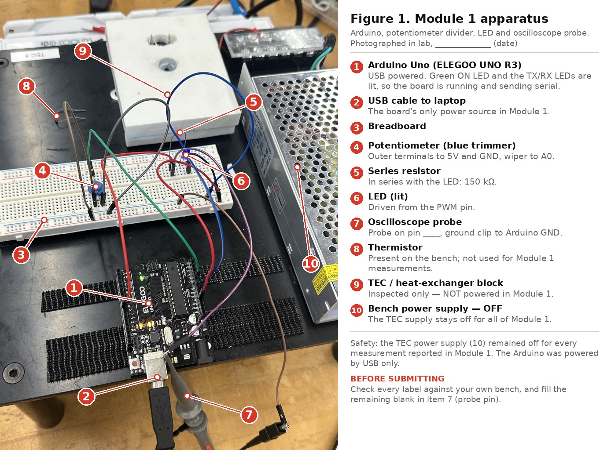
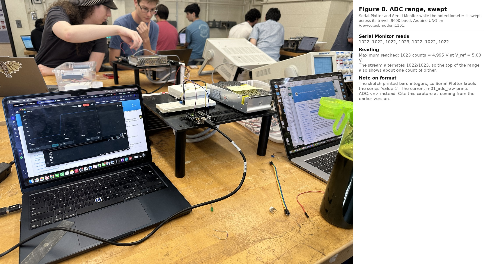
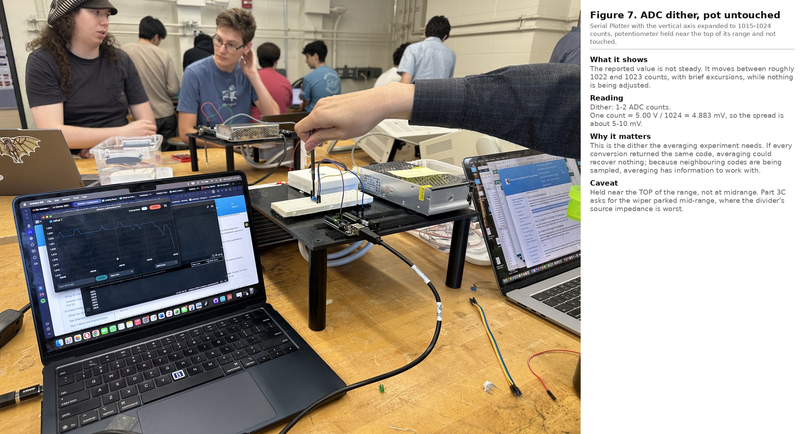
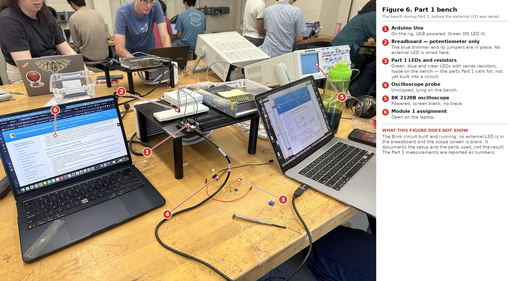
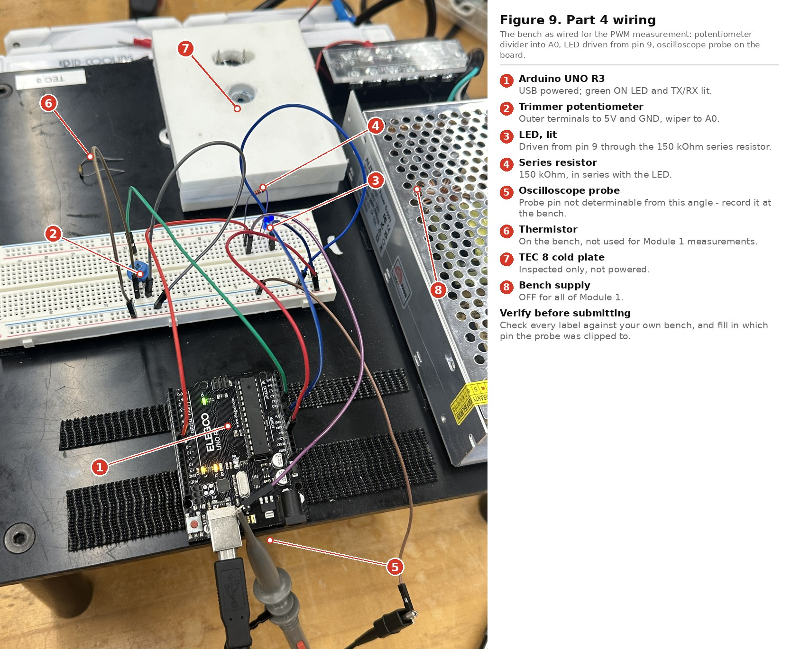
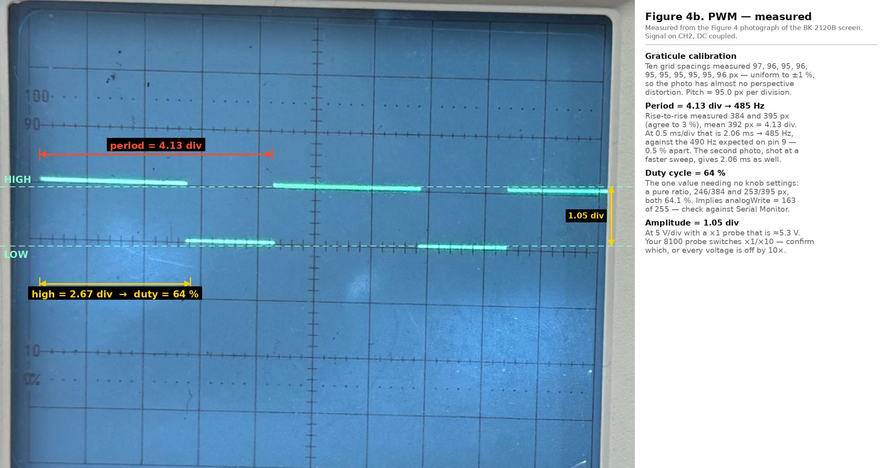
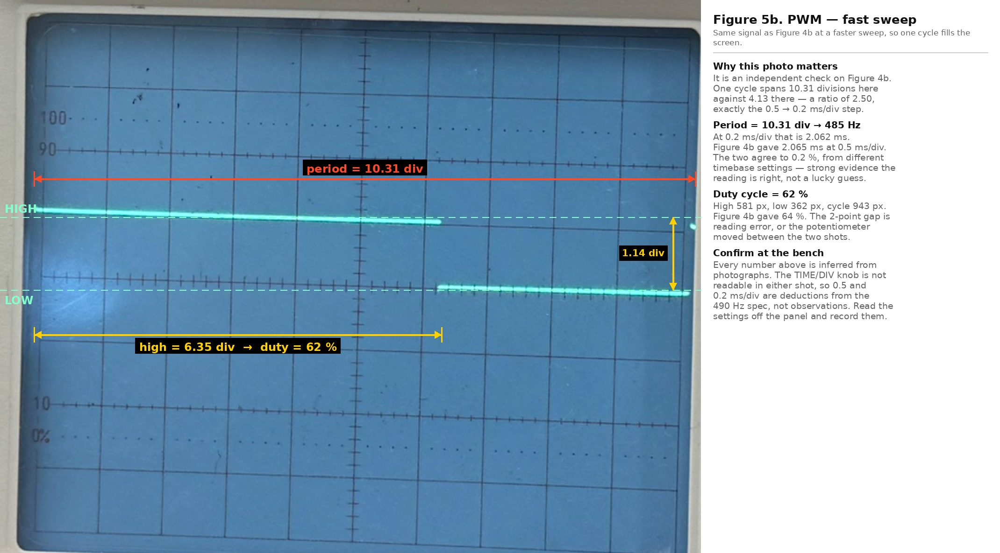
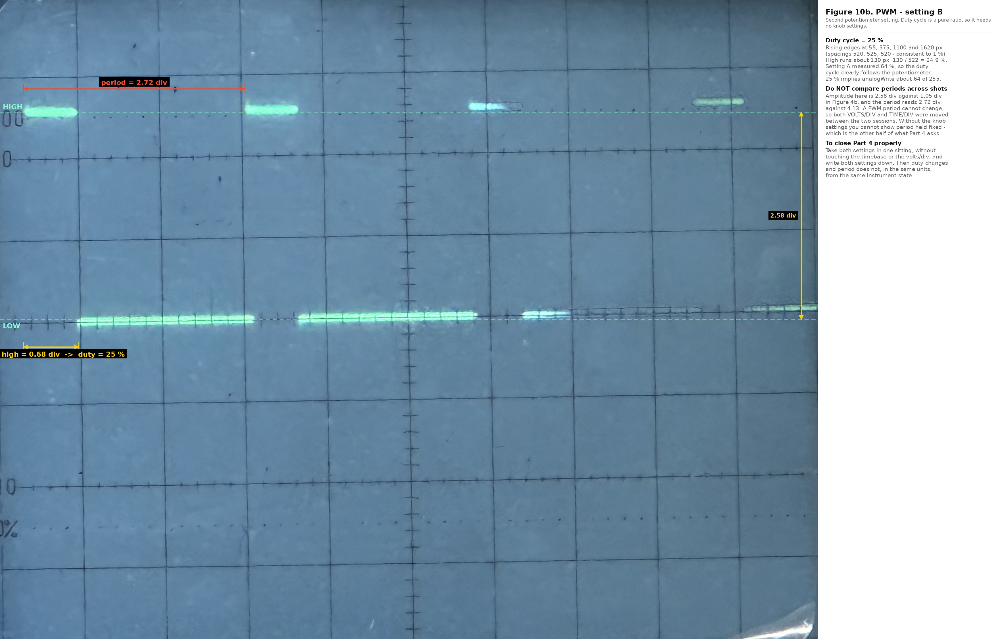

# A1 — Module 1 Evidence Note

**Phys 39 — Instrumentation and Thermal Physics · Team TEC 8**

| | |
|---|---|
| **Assessment code** | A1 (graded team assignment, 5 points) |
| **Team members** | `FILL IN: both members' full names` |
| **Date** | `FILL IN` |
| **Repository URL** | `FILL IN: https://github.com/<org-or-user>/LabModule1` |
| **Git checkpoint (GC) commit** | `FILL IN: full 40-character hash` |

> **Safety.** The Arduino was powered by USB only. The TEC power supply remained off for every
> measurement reported here.
>
> **Conventions.** 9600 baud throughout; volts = ADC counts × 5.00 / 1024, so one count is
> 4.883 mV. V_ref was not measured — the nominal 5.00 V is assumed everywhere below.

---

## 1. Apparatus

**Figure 1.** Module 1 apparatus. Arduino Uno (ELEGOO UNO R3) on USB power; 100 kΩ trimmer
potentiometer as a divider into `A0`; LED with a 150 kΩ series resistor; oscilloscope probe.
Thermistor, TEC 8 cold plate and bench supply present but not powered.

**Wiring.** Pot outer terminals → `5V` and `GND`, wiper → `A0`. Built-in LED on pin 13.
External LED: pin `9` → 150 kΩ → LED → `GND`; the same LED serves Parts 1 and 4. Oscilloscope
on CH2, DC coupled, probe on `FILL IN: pin ___`, ground clip to Arduino `GND`.

**Instrument.** BK Precision 2120B, 30 MHz dual trace — **analog**. No cursors, no measurement
readout, no screenshot export. Every scope value below is read off the graticule and converted
using the front-panel settings.

**On the 150 kΩ series resistor.** The assignment specifies 200–4000 Ω, so this is a departure
worth stating plainly. With a blue LED (V_f ≈ 3.1 V) on a 5 V rail it passes
(5.0 − 3.1)/150 kΩ ≈ 13 µA, roughly forty times below the low end of the specified range, which
makes the Part 4 brightness check hard to see by eye. It does not affect any measurement
reported here: the oscilloscope reads the pin voltage, not the LED current, and at 13 µA the
output driver is essentially unloaded, so the high level sits at nearly the full supply rail
with no sag.

---

## 2. Code

| Sketch | Supports |
|---|---|
| [`m01_blink_ratio.ino`](../../firmware/module_01/m01_blink_ratio/m01_blink_ratio.ino) | §5 Blink |
| [`m01_adc_raw.ino`](../../firmware/module_01/m01_adc_raw/m01_adc_raw.ino) | §3 ADC |
| [`m01_adc_voltage.ino`](../../firmware/module_01/m01_adc_voltage/m01_adc_voltage.ino) | §3 conversion |
| [`m01_avg_compare.ino`](../../firmware/module_01/m01_avg_compare/m01_avg_compare.ino) | §4 averaging |
| [`m01_avg_stats_onboard.ino`](../../firmware/module_01/m01_avg_stats_onboard/m01_avg_stats_onboard.ino) | §4 on-board σ |
| [`m01_avg_timing.ino`](../../firmware/module_01/m01_avg_timing/m01_avg_timing.ino) | §4 acquisition time |
| [`m01_pwm_from_pot.ino`](../../firmware/module_01/m01_pwm_from_pot/m01_pwm_from_pot.ino) | §5 PWM |

Superseded variants are in [`firmware/module_01/archive/`](../../firmware/module_01/archive/)
and produced none of the numbers below.

**Provenance.** `m01_blink_ratio.ino` is a consolidated reconstruction — the lab work used
direct edits to the stock Arduino Blink example, and this file reproduces those three cases
with the same delay constants. The §3 captures were made with an earlier sketch that printed
bare integers rather than the `ADC:<n>` format the current file uses.

---

## 3. ADC digitization

**Figure 8.** Potentiometer swept across its travel. Serial Monitor reads 1022, 1022, 1022,
1023, 1022, 1022, 1022.

**Figure 7.** Vertical axis expanded to 1015–1024 counts, potentiometer untouched.

| Quantity | Value | Source |
|---|---|---|
| Maximum count reached | **1023** = 4.995 V | measured, Fig 8 |
| Lowest count observed | **20** = 97.7 mV | measured mid-sweep — an **upper bound** on the minimum, not the minimum |
| Dither at a fixed setting | **1–2 counts** ≈ 5–10 mV | measured, Figs 7 and 8 |
| One-count step ΔV = V_ref / 1024 | **4.883 mV** | calculated at the nominal 5.00 V |
| Midrange setting held | — | not captured |

### Why the readings occupy discrete levels

The ADC does not report a voltage; it reports which of 1024 integer codes the input fell into.
The 0–5 V span is divided into 1024 windows of 4.883 mV each, so every input inside one window
produces the same code, and the output can only ever be one of 1024 values. Printing the result
as `2.4561 V` rather than `503` rescales that integer into volts but adds no physical
information — the underlying measurement still has exactly 1024 possible outcomes, and the
extra decimal places are an artefact of the arithmetic rather than evidence of finer
resolution. The apparent smoothness of a plotted trace comes from the plotter drawing straight
lines between discrete points, not from the ADC resolving anything between them.

### Do the values vary when nothing is touched?

Yes. Both figures show the reported code moving between 1022 and 1023 while the potentiometer
is untouched, occasionally spanning about two counts — roughly 5–10 mV of fluctuation. The
sources are ordinary: thermal noise in the divider, ripple and switching noise on the USB-derived
5 V rail, mains pickup on the leads, and the ADC's own comparator noise. Because the divider
sits at 100 kΩ, its Thévenin source impedance reaches 25 kΩ at midrange, well above the
ATmega328P's recommended ≤10 kΩ, which leaves the sample-and-hold capacitor less time to settle
and makes the converter more susceptible to all of these.

This dither is not merely a nuisance — it is the precondition the averaging experiment depends
on. If the input were perfectly quiet and every conversion returned the same code, averaging
would return that same code forever and could recover nothing. Because neighbouring codes are
being sampled, the fraction of samples landing in each code carries information about where
between them the true voltage lies, and averaging extracts it.

### Serial Monitor versus Serial Plotter

Each display hides what the other shows. Serial Monitor gives the exact integer for every
sample, so a one-count step is unambiguous and untagged text (labels, version strings) is
visible — but a column of numbers scrolling past makes it nearly impossible to see whether the
signal is drifting, oscillating, or steady. Serial Plotter shows that shape immediately: the
autoscaled trace in Figure 7 makes a 1–2 count wander obvious at a glance, and a drift over
several seconds would be visible as a slope. What it will not give you is the value of any
individual point, and it silently discards any text it cannot parse as a labeled number. The
two are complementary, and Part 3A is best answered by having both open at once.

---

## 4. Averaging and acquisition time

### Measurement status

**The averaging experiment was not captured.** `m01_avg_compare`, `m01_avg_stats_onboard` and
`m01_avg_timing` were written and compile, but no saved run exists, so σ₁, σ₁₀₀₀, their ratio,
the smallest discrete voltage jump and the elapsed time for 1000 conversions are all
outstanding, and Figures 2 and 3 were not taken.

| Potentiometer block | Points | N | Mean (V) | σ (mV) | σ_N/σ_1 measured | σ_N/σ_1 predicted |
|---|---|---|---|---|---|---|
| Unaveraged | 100 | 1 | not measured | not measured | — | 1.000 |
| Long average | 100 | 1000 | not measured | not measured | — | 0.0316 |

The one relevant quantity this repository does measure is the 1–2 counts of dither in §3, which
establishes that averaging *would* work here, but not by how much.
[`analysis/module_01/averaging_stats.py`](../../analysis/module_01/averaging_stats.py) will
produce every entry in the table from a capture when one is taken.

### Why averaging improves precision

Each conversion carries an independent random error of standard deviation σ₁. Averaging N such
readings averages the errors too, and the standard deviation of the mean of N independent
samples is σ₁/√N. The signal is unchanged by averaging, so precision improves by a factor √N:

    σ_N / σ_1 = 1/√N,   and for N = 1000,   1/√1000 = 0.0316

One bit of resolution is a factor of two, so the number of bits gained is

    bits = log₂(√N) = ½ · log₂ N
    N = 1000:   ½ × 9.966 = 4.98 ≈ 5 effective bits

so a 10-bit converter can, under the right conditions, report a value with roughly 15 bits of
effective precision.

**The assumptions this requires, and why each matters.** The underlying voltage must be constant
over the averaging window, or the mean tracks the drift rather than the value. The fluctuations
must have approximately zero mean, or averaging converges on a biased value rather than the true
one. Successive readings must be sufficiently independent — correlated errors do not average
down as 1/√N, and correlated pickup such as 60 Hz mains hum can survive averaging almost intact.
And there must be enough analog noise to dither across neighbouring codes, for the reason given
in §3.

**Precision is not accuracy.** Averaging reduces random scatter about whatever value the
instrument reports. It does nothing about systematic error: if V_ref is really 4.93 V and the
sketch assumes 5.00 V, every averaged reading is 1.4 % wrong no matter how many samples are
taken, and the tighter scatter simply makes the wrong answer look more confident. This is why
V_ref should be measured rather than assumed, and it is a limitation carried by this note.

### Time cost: averaging as a low-pass filter

The Arduino reference gives roughly 100 µs per `analogRead()` conversion, about 10 kSa/s, so
1000 readings should take roughly 0.10 s before any arithmetic or serial output is added.

Averaging 1000 consecutive samples is a boxcar (moving-average) filter of width ≈0.10 s, and a
boxcar filter is a low-pass filter. Fluctuations faster than the window average toward zero —
that cancellation *is* the precision gain — but any genuine change in the input during the
window is smoothed and delayed rather than reported. The precision bought is paid for directly
in time resolution: the same operation that removes noise also removes real signal above
roughly 10 Hz, and it delays the reported value by about half the window.

That trade is the central design tension of the instrument this course is building. A
temperature controller that averages heavily reads its sensor very precisely but learns about a
disturbance late, and a control loop that acts on stale information can overshoot or oscillate.
Choosing N is choosing where to sit between a noisy fast loop and a quiet slow one.

---

## 5. Digital output and PWM

### Blink (Part 1) — calculated, not measured

**Figure 6.** The Part 1 bench and components. Setup only — the external LED is not wired in
this shot and the scope screen is blank, so it is not evidence that the circuit ran.

The sketch is the stock Arduino Blink example, modified to drive an external LED on pin 9
alongside `LED_BUILTIN` and to select the ratio from one constant. The values below come from
the delay constants; the voltages are nominal ATmega328P output levels. Nothing here was
measured.

| `RATIO_CASE` | Ratio | On/off (ms) | Period (s) | Frequency (Hz) | Duty (%) | High/Low (V) |
|---|---|---|---|---|---|---|
| 0 | 1:1 | 1000 / 1000 | 2.000 | 0.500 | 50.0 | 5.0 / 0.0 nom. |
| 1 | 10:1 | 1000 / 100 | 1.100 | 0.909 | 90.9 | 5.0 / 0.0 nom. |
| 2 | 1:10 | 100 / 1000 | 1.100 | 0.909 | 9.1 | 5.0 / 0.0 nom. |

One delay was held at the stock 1000 ms and the other scaled, so **period and frequency change
between the cases as well as duty cycle**. The 10:1 and 1:10 cases share a period and differ
only in duty, which makes them the cleanest pair to compare. Treat the periods as lower bounds:
`delay()` blocks for *at least* the requested interval, and `digitalWrite` plus loop overhead
add to it, so the true periods run slightly above 2.000 s and 1.100 s by an amount this method
cannot resolve.

**No oscilloscope figure, for a reason worth stating.** At 0.5–0.9 Hz a single period is longer
than the 2120B's entire slowest sweep (0.1 s/div × 10 div = 1 s). At that speed the CRT spot
crawls across the screen and the phosphor decays long before the sweep completes, so no
persistent trace ever forms — there is nothing on the screen to photograph. The PWM waveform
below, three orders of magnitude faster, does persist, and that contrast is itself a concrete
demonstration of the persistence limit of an analog CRT.

### PWM (Part 4) — measured

**Figure 9.** The bench as wired for Part 4.

**Figure 4b.** Setting A. The graticule was calibrated from ten grid spacings in the photograph
itself (97, 96, 95, 96, 95, 95, 95, 95, 95, 96 px — uniform to ±1 %, so perspective distortion
is negligible): 95.0 px per division.

**Figure 5b.** The same signal at a faster sweep — an independent check on Figure 4b.

**Figure 10b.** Setting B.

| | Setting A | Setting B | Basis |
|---|---|---|---|
| **Duty cycle** | **64 %** | **25 %** | measured; a pure ratio, independent of any knob setting |
| Period | 4.13 div | 2.72 div | measured in divisions |
| Amplitude | 1.05 div | 2.58 div | measured in divisions |
| VOLTS/DIV | 5 V/div | 2 V/div | inferred — a 5 V logic swing over the measured divisions gives 4.76 and 1.94 V/div, and the nearest standard steps are 5 and 2 |
| High / Low voltage | ≈5.3 / ≈0 V | ≈5.2 / ≈0 V | from amplitude × inferred V/div |
| Implied `analogWrite` | ≈163 / 255 | ≈63 / 255 | inferred from duty |
| Implied averaged voltage | ≈3.20 V | ≈1.24 V | inferred back through `map()` and the ADC conversion, not read from Serial Monitor |
| TIME/DIV | 0.5 ms/div | see below | inferred for A |
| Period in time | 2.06 ms | — | follows from the TIME/DIV inference |
| **Frequency** | **485 Hz** | — | vs ≈490 Hz expected on Uno pin 9 |

**Setting A.** Figures 4b and 5b were shot at two different sweep speeds and give the same
period to 0.2 %, which is what makes 485 Hz credible — it is a cross-check rather than a single
reading. The inference is singular, though: assuming 0.5 ms/div is what *produces* 485 Hz, so
agreement with the 490 Hz specification corroborates that assumption rather than independently
confirming the frequency.

**Setting B — the TIME/DIV cannot be inferred.** At 2.72 divisions per period, no standard step
yields the expected ≈490 Hz: 0.5 ms/div gives 735 Hz, 1 ms/div gives 368 Hz, and the ≈0.75 ms/div
that would fit is not a setting the instrument has. Either the variable timebase control was off
its calibrated detent, or the division count is slightly wrong because the screen edges were
judged from a photograph. Reading the panel at the bench settles it, and until then no frequency
is claimed for setting B.

**Which quantities change and which stay fixed.** Duty cycle clearly follows the potentiometer —
64 % against 25 %, measured without needing any calibration at all, since it is the ratio of the
high run to the rise-to-rise spacing. **That period and amplitude stay fixed is not yet
demonstrated by this evidence:** amplitude reads 1.05 div and 2.58 div, and period 4.13 div and
2.72 div, so both VOLTS/DIV and TIME/DIV must have been altered between the two sessions — a PWM
period is set by the timer and cannot actually change. Capturing both settings in one sitting
without touching the controls would close it. On the physics, the period is fixed by Timer1's
prescaler and the 16 MHz clock, and `analogWrite` changes only the compare value, so duty is the
only quantity software can move.

**Why the LED looks continuously lit.** At ≈485 Hz the LED is switching on and off roughly 485
times a second, about an order of magnitude above the 50–60 Hz range at which flicker typically
fuses into steady light, so the eye and brain integrate the pulses into a constant apparent
brightness rather than resolving them. The oscilloscope has no such integration and shows the
individual pulses directly. Flicker fusion is not one universal frequency: it rises with
brightness and contrast, it is higher in peripheral vision than at the centre of gaze, and it
depends on the fraction of the field the source occupies and on the observer. A dim LED viewed
directly may appear steady at 50 Hz while a bright one seen from the corner of the eye still
flickers noticeably at 80 Hz — which is why the 50–60 Hz figure is a rule of thumb rather than a
threshold.

**Precision through the chain.** `m01_pwm_from_pot` averages 1000 readings, then casts the
result to `int` before `map(…, 0, 1023, 0, 255)`. The effective bits that averaging buys cannot
survive an 8-bit actuator command in any case — the PWM output has only 256 levels — so
precision at the sensor does not automatically become precision at the actuator. That is a real
instrument-design point and it will matter again when this loop drives the TEC.

### What the oscilloscope showed that the serial displays did not

The essential difference is between a direct electrical measurement of the pin and a set of
values chosen and printed by software. Serial Monitor and Serial Plotter report samples that the
sketch decided to take, at whatever rate the sketch decided to print them, already converted to
numbers by the ADC and the program's arithmetic; the oscilloscope draws the voltage on the wire
itself, on its own timebase, with no involvement from the program at all. That distinction has
concrete consequences here. The serial displays could never have shown the ≈2 ms PWM period,
because at 9600 baud with a `delay()` in the loop they report at a few tens of hertz — three
orders of magnitude too slow — and in any case they were displaying the *commanded* duty value,
not the waveform that command produced. The scope resolved the individual pulses, the actual
high and low rail levels, and the true period, which is what let us confirm that the pin really
was switching at the ≈490 Hz the datasheet promises rather than merely that the program had
asked it to. Put another way: the serial output can tell you what the software believes, and
only the oscilloscope can tell you whether the hardware agreed.

---

## 6. C1 Question 9 — the Arduino Uno analog input

The Uno's analog input is a successive-approximation ADC that measures a **voltage** — not a
current, and not a resistance except through a divider that converts resistance to voltage. It
measures relative to a reference: the input range runs from 0 V to V_ref, nominally the 5 V
supply, and any input above V_ref simply saturates at the top code.

The converter is **10-bit**, so it divides that range into 2¹⁰ = 1024 levels and reports an
integer code from **0 to 1023**. One count is therefore V_ref/1024 = 5.00 V/1024 ≈ **4.88 mV**,
which sets the finest voltage difference a single conversion can distinguish.

A conversion takes roughly **100 µs**, giving a maximum sustained rate of about 10 000
samples per second — although the practical rate in a sketch is usually much lower, because
`Serial.print` and any `delay()` in the loop dominate. Six input channels (A0–A5) share one
converter through an analog multiplexer, so channels are sampled in turn rather than
simultaneously, and switching channels requires the sample-and-hold to settle again.

The datasheet recommends a source impedance of **≤10 kΩ**, because the internal
sample-and-hold capacitor must charge through whatever impedance the source presents within the
sampling window. The 100 kΩ divider used here reaches 25 kΩ at midrange and therefore exceeds
that recommendation — worth noting as a limitation of the assigned circuit rather than a fault
in the measurement.

## 7. C1 Question 10 — the Arduino Uno PWM output

A PWM output is a **digital** pin being switched rapidly between two voltages, ≈0 V and ≈5 V. It
is driven with `analogWrite(pin, value)` where value runs **0 to 255**, and that value sets the
**duty cycle** — the fraction of each period the pin spends high — as duty = value/255. The
switching **frequency** is fixed by the timer hardware: approximately **490 Hz** on pins 3, 9,
10 and 11, and approximately 980 Hz on pins 5 and 6.

**PWM is not a true analog voltage.** At every instant the pin is at one rail or the other; it
never rests at an intermediate level. What varies continuously is the *average* over a period,
and that average only becomes a physical quantity when something integrates it — an RC low-pass
filter, the thermal mass of a heater, the mechanical inertia of a motor, or the persistence of
the human eye watching an LED. Measured with an oscilloscope, as in §5, the signal is
unmistakably a square wave and not a varying DC level; measured with a slow DC voltmeter it
would read the average and look like one. Which of those two answers is correct depends entirely
on what the load does with it.

**A power stage is required to drive a motor or a TEC.** An ATmega328P pin can source only tens
of milliamps at 5 V — tens of milliwatts — while a TEC or a motor needs amperes from a separate
supply, several orders of magnitude more. The pin cannot supply that, and connecting it directly
would destroy it. The H-bridge is the power stage that resolves this: the low-power logic signal
gates a high-current path from the bench supply through the load, so the microcontroller
controls the power without carrying it. The bridge topology additionally allows the current to
be driven in **either direction** through the load, which is essential for a TEC, since
reversing the current swaps the hot and cold faces and turns a cooler into a heater. That is the
mechanism by which the controller this course is building will be able to drive temperature in
both directions from a single actuator.

---

## Before submitting

Five items only the team can supply:

1. Both members' full names, in the header and in the PDF filename
2. Date
3. Repository URL
4. Full 40-character commit hash — export the PDF **after** the final push, so the hash on
   page 1 is the hash of the pushed checkpoint
5. Which pin the oscilloscope probe was clipped to (§1)

Then check that every figure renders in the exported PDF, export as
`A1_Lastname_Lastname.pdf`, and have **both** teammates upload it to the A1 Moodle activity
before Monday 14 September, 5:00 PM.

Outstanding measurements are listed in
[`docs/reference/MISSING_ITEMS.md`](../reference/MISSING_ITEMS.md); the averaging block in §4 is
the one that carries a full rubric line.
